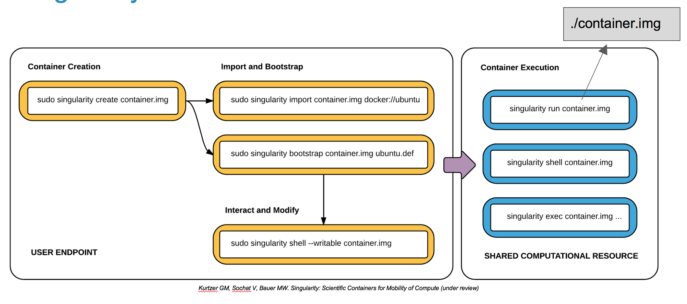

name: inverse
layout: true
class: center, middle, inverse
---
# Singularity on Openmind
### satra@mit.edu
---
Many thanks to the Singularity team

[source](https://github.com/satra/om-images/tree/gh-pages) | CC-BY

(You can update this presentation - just send a pull-request)
---
layout: false
### Software Dependencies and Reproducible Research

- Each project in a lab depends on complex software environments
  - Operating system
  - Drivers
  - Software dependencies
     - Python/MATLAB/R versions
     - glibc
     - various other libraries, executables

--
- Each project has its own timeline
  - Maintaining common software repositories is "Oh so 20th century!"
  - Really hard on systems like Openmind
     - One of these days modules will clash

--
- Reproducible research requires consistent computing environments
  - Data **AND** code **AND** compute environments
  - Passing environments has not been straightforward
---
### Virtual Machines and Container Technologies

- Main idea: Isolate the computing environment
  - Corollary: Allow regenerating computing environments

--
- Types:
  - Virtual Machines
     - [Virtualbox](https://www.virtualbox.org/)
     - [VMware](http://www.vmware.com/)
     - [AWS](http://docs.aws.amazon.com/AWSEC2/latest/UserGuide/AMIs.html), [Google Compute](https://cloud.google.com/compute/), ...
  - Containers
     - [Docker](https://www.docker.com/)
     - [runc](https://runc.io/)
     - [lxc/lxd](https://linuxcontainers.org/)
     - [Singularity](http://singularity.lbl.gov/)

--
- The details differ (and matter depending on application)
  - [Singularity vs everything else](http://singularity.lbl.gov/faq#general-singularity-info)
---
### The ecosystem: Vagrant, Docker and GitHub

- Vagrant boxes for Virtual Machines
    - Vagrant can be scripted with a Vagrantfile

--
- Docker + Dockerhub has created an ecosystem of Containers
    - Dockerhub integrates with GitHub
    - Create a specification (Dockerfile) on GitHub
    - Create an integration between GitHub and Dockerhub
    - Dockerhub will automatically build when you change the specification

--
- Can we do this on Openmind?
    - We **can** run Vagrant on Openmind
    - We **cannot** run docker on Openmind
        - Primarily because of security (root escalation possible)
---
template: inverse


---
template: inverse

### We want containers
### VMs are too heavy
### Docker is not allowed
---
layout: false
### Enter [Singularity](http://singularity.lbl.gov/user-guide)

[Singularity](http://singularity.lbl.gov/user-guide) was built for HPC, to support containerized environments, and to support reproducible science.

<div style="position:relative;height:0;padding-bottom:56.25%"><iframe src="https://www.youtube.com/embed/h5rDnCA3NJA?ecver=2&start=252" frameborder="0" style="position:absolute;width:100%;height:100%;left:0" allowfullscreen></iframe></div>
.right[A FlyElephant Webinar]
---
template: inverse
## The Singularity workflow


---
### Let's start with an example

I needed to send DICOMs to a DICOM receiver. I could
- write something in python, or
- compile dcmtk to give me an executable called `storescu`.
--

## OR

--
```bash
# Add singularity
$ module add openmind/singularity/2.2.1
```
--
```bash
# Download a container and go in
$ singularity shell -B /some_om_path:/mnt docker://ggonzale/dcmtk
```
--
```bash
# Send dicoms from within this environment
> storescu -aec AEC +sd +sp MR* -v somehost 8104 /mnt/path_to_dicoms
```
--
I did not need to download and compile code or talk to a system administrator.
---
name: agenda

### Singularity on Openmind

What we will cover in the remaining time!

0. Environment variables
1. Running a docker image
   - what's the difference between a docker container and a singularity container
   - how to resolve mounting /om
2. Writing specifications to create images
   - Using [GitHub](https://github.com):
      - Dockerfile for [Dockerhub](https://hub.docker.com/)
      - Singularity for [Singularity-hub](https://singularity-hub.org/)
3. Using [Vagrant](https://www.vagrantup.com/) to create an image
   - Openmind peculiarities (vagrant dir, vbox vm dir)
   - using /dev/shm to create images
4. Creating and using a singularity image that uses a GPU
5. Q&A

---

### Environment variables

**Singularity related variables**

- `$SINGULARITY_CACHEDIR` controls where containers are downloaded to or expanded
- `$HOME` is mounted into the container
    - so anything on `$PATH` that exists in `$HOME` is available inside the container
- Environment variables are carried over
    - just like `srun/sbatch`
    - Understand: `$PATH`, `$LD_LIBRARY_PATH`, `$PYTHONPATH`, `$OMP_NUM_THREADS`, ``$CUDA_VISIBLE_DEVICES`, etc.,.

**Vagrant related variables**

- `$VAGRANT_HOME` - location of vagrant directory
- `machinefolder` a property for Virtualbox that determines locations of _**running**_ virtual machines.

---
### Let's get started

We need to set up our environment. We will use the interactive queue so that we can do things during this tutorial. (But it will be limited to 32 participants)

```bash
# Get on a compute node interactively
$ srun -N1 -c2 -p om_interactive --pty bash

# Execute all commands on the compute node
$ module add openmind/singularity/2.2.1

# for this tutorial we will use scratch
$ mkdir /om/scratch/Thu/`whoami`
$ mkdir /om/scratch/Thu/`whoami`/st
$ mkdir /om/scratch/Thu/`whoami`/st/cache

# These images can be large, so store them across disks
$ lfs setstripe -c -1 /om/scratch/Thu/`whoami`/st/cache

# We will use this location to download and store images
$ export SINGULARITY_CACHEDIR=/om/scratch/Thu/`whoami`/st/cache
$ cd /om/scratch/Thu/`whoami`/st
```

---

### Example 1: Running a docker image

Let's run a tiny docker image

```bash
# Still on compute node
$ ls /etc
$ singularity shell docker://busybox

# Inside container
> ls /etc
> whoami
> ls $HOME
```
<br/>
Now let's exit the container and get a more extensive image.
```bash
> exit

$ singularity shell docker://tensorflow/tensorflow:1.0.0-gpu-py3
> /usr/bin/python -c "import tensorflow as tf"
> exit
```

---

### Example 1: continued

Now let's look at a few things after exiting the container

```bash
$ ls cache
$ singularity shell cache/singularity-rundir.*/tensorflow/*1.0.0-gpu-py3/

> ls /om
> exit
```
<br />
Oops, we need our data. First we need to create a bind point inside the container.

```bash
$ pushd cache/singularity-rundir.*/tensorflow/*1.0.0-gpu-py3/
$ mkdir om
$ popd
$ singularity shell -B /om:/om cache/singularity-rundir.*/tensorflow/*1.0.0-gpu-py3/

> ls /om/user/`whoami`
```

---

### Moving from images to specifications

Sharing images is great for repeatability
- What if you wanted to modify the image?
- What if you wanted to know what is inside the image?

--

Look at the specification

--

There are two types of specifications you can use:
1. `Dockerfile` to build an image using docker or [dockerhub](https://hub.docker.com/) and then convert to Singularity
2. A `Singularity` file to create an image using singularity (needs root privileges) or [singularity hub](https://singularity-hub.org/).

For using either hub, you will need to create an account on GitHub, and create a project that you then link with the Hub.

---

### A simple Singularity specification

```bash
BootStrap: Docker
From: debian:8.5
```
--

So one can bootstrap from Docker, but you can bootstrap straight from Debian.

```bash
BootStrap: debootstrap
OSVersion: stable
MirrorURL: http://ftp.us.debian.org/debian/


%runscript
    echo "This is what happens when you run the container..."


%post
    echo "Hello from inside the container"
    apt-get update
    apt-get -y install vim
```

---

### Singularity and GitHub

- [Examples of bootstrap files](https://github.com/singularityware/singularity/tree/master/examples)

- [Example Github project for Openmind](https://github.com/satra/om-images)

- [Singularity Hub builds](https://singularity-hub.org/collections/60/)

---
### Using Vagrant to create an image

A few things about Openmind

- Vagrant terminology: `box`, `virtual machine`
  - Vagrant downloads, builds and exports boxes
  - VirtualBox creates and runs Virtual Machines
- Vagrant stores boxes in `$VAGRANT_HOME`
- Virtualbox stores VMs in `machinefolder`
  - defaults to `$HOME/VirtualBox VMs`

--

- Each user has a quota of 5G in `$HOME`

--
## IF YOU ARE CURRENTLY RUNNING A VM STOP

--

**Note:** The following changes can impact the VM

```bash
export VAGRANT_HOME=$PWD/vagrant
vboxmanage setproperty machinefolder $PWD/VBVMs
```
.footnote[ .red[\*] Instead of `$PWD` you can create and use ``` /dev/shm/\`whoami\` ``` to speed things up!]
---
### Using Vagrant to create an image

First create a bootstrap file and name it Singularity. This will specify what your image contains

```bash
BootStrap: Docker
From: debian:8.5

%post
   mkdir /om
   mkdir /cm
```
---
### Spin up Virtual Machine and install singularity

```bash
$ vagrant init ubuntu/trusty64
$ vagrant up
$ vagrant ssh -c /bin/sh <<EOF
   sudo apt-get update
   sudo apt-get -y install build-essential
   sudo apt-get -y install curl git man vim autoconf libtool
   git clone https://github.com/singularityware/singularity.git
   cd singularity
   ./autogen.sh
   ./configure --prefix=/usr/local
   make
   sudo make install
EOF
$ vagrant ssh
```

---
### Creating the singularity image inside the VM

```bash
$ sudo singularity create -s 2048 debian.img
$ sudo singularity bootstrap debian.img /vagrant/Singularity
$ singularity shell debian.img
$ cp debian.img /vagrant
$ exit
```

Back on your node shell:

```bash
$ singularity shell debian.img

> ls /om
> exit

$ vagrant destroy
```

---
### Using a GPU and installing an NVIDIA driver

[Example Singularity file](https://github.com/satra/om-images/blob/tensorflow-gpu/Singularity)

I've already built it using Singularity Hub.

```bash
# Let's get a node with a GPU
$ srun -N1 -c2 --gres=gpu:1 --pty bash

# To pull from shub, we need a more bleeding version
$ module rm openmind/singularity/2.2.1
$ module add openmind/singularity/2.2.1-0ga71d50c

# Get the image from Singularity hub
$ singularity shell -B /om:/om shub://satra/om-images:tensorflow-gpu
```

But instead of retrieving the image every time, we can use the image already on `/om`

<code>
$ singularity exec $SINGULARITY_CACHEDIR/shub/4982e62f95c389e9b4af2c88d24b1f83aac938dd.img /usr/bin/python $HOME/convolutional.py
</code>

.footnote[ .red[\*] We can share these images]
---
class: middle center

# Questions
